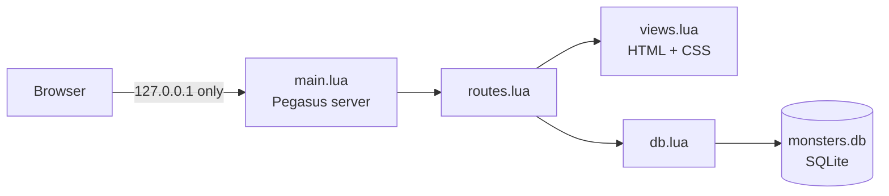

# 🐉 Monsters Compendium


A compendium of **monsters and spells for Dungeons & Dragons 1st Edition**, built to be
searched quickly behind the GM screen and to be **shared safely with other game masters**.

> 🚧 **Work in progress.** The data layer and the configuration are done; the web
> interface is being rebuilt. See the [roadmap](#-roadmap) for exactly where things stand.

---

## 📖 Why this project is changing

The first version of this project was a REST API running in Docker, with PostgreSQL,
OpenResty and Lapis. It worked on my machine, but it was the wrong shape for
**handing to someone else**:

| Problem in the first version | What it means for other people | What replaces it |
|---|---|---|
| 🐳 Needs Docker, Compose and three services | A GM has to be a sysadmin to open a bestiary | One program, one file |
| 🔑 Default `postgres` / `postgres` password in the repo | Anyone who starts it as-is has a guessable password | No database server, no password |
| 🌐 API published on all network interfaces | Anyone on the same Wi-Fi could add or delete monsters | Listens on `127.0.0.1` only |
| 🐞 `development` mode with full error pages | Errors could leak internal paths | Generic errors; details go to a log file |
| 🗂️ Data stored inside the project folder | Updating the program could wipe a campaign | Data lives in the user's own data folder |

So I am moving everything to a form that can be **downloaded and opened**, and I am
treating security as part of the design, not as something to add at the end.

## 🧭 How it works



The program starts a small web server **on your own computer**, picks a free port and
opens your browser. Nothing is sent to the internet, and no other device can reach it.
The pages are plain **HTML and CSS generated from Lua**: searching is a normal form,
saving is a normal form. There is **no JavaScript** at all.

## 🧰 Stack

| | Piece | What it does |
|---|---|---|
| 🌙 | **Lua** | The whole program. Developed on Lua 5.5; written to run on 5.1+ (older versions not tested yet) |
| 🛩️ | **[Pegasus](https://github.com/EvandroLG/pegasus.lua)** | Small HTTP server written in Lua |
| 🗄️ | **SQLite** (`lsqlite3complete`) | The database, as one file. SQLite is bundled, so nothing to install on the system |
| 🧾 | **[dkjson](http://dkolf.de/dkjson-lua/)** | JSON for the optional API |
| 🔌 | **luasocket** | Network sockets (used by Pegasus) |
| 🎨 | **HTML + CSS** | Generated from Lua. Light and dark themes, print-friendly stat blocks |
| 🤖 | **GitHub Actions** | Planned: build downloadable packages for Windows, macOS and Linux |

**Removed:** Lapis, OpenResty, PostgreSQL, Docker, Nginx.

> 🎓 **About the HTML and CSS:** this is new territory for me. I am learning it as I go,
> so the views are kept small and commented. Suggestions and corrections are very welcome.

## 🔒 Security design

Security decisions made from the start:

- 🏠 **Local only** – the server binds to `127.0.0.1`, never to the network.
- 🛡️ **Blocks other websites** – requests with an unexpected `Host` or `Origin` header are
  refused, which stops a hostile web page in your browser from sending commands to the app.
- 🚫 **No scripts** – every page is served with a Content-Security-Policy that forbids JavaScript.
- 💉 **No SQL injection** – every query uses bound parameters; user text is never glued into SQL.
- 🧼 **No HTML injection** – everything coming from the database or a form is escaped before it is shown.
- 🧱 **Input limits** – text length, number ranges and request size are capped.
- 📁 **Data outside the install folder** – updating the program never touches your campaign.
- 🤫 **Quiet errors** – details go to a log file, the browser only sees a generic message.

**Honest limits:** Pegasus is a lightweight server meant for local use. **Do not expose
this program to the internet.** There is no login, because it is a single-user local app.
This design has not had an independent security review yet.

## 🗺️ Roadmap

**Foundation**
- [x] 🗄️ `db.lua` – SQLite data layer, schema migrations, prepared statements
- [x] ⚙️ `config.lua` – per-user data folder, ports, paths
- [ ] 📄 `LICENSE` (MIT) and dependency list (`.rockspec`)
- [ ] 🧪 `tests/db_test.lua` – tests for the data layer, using an in-memory database

**Monsters**
- [ ] 📥 JSON import/export, so nobody has to type hundreds of entries by hand
- [ ] 🧱 Minimal server and packaging skeleton, tested on Windows early
- [ ] 🎨 `views.lua` and `style.lua` – HTML and CSS
- [ ] 🔎 Monster list with search (name, category, XP)
- [ ] 📜 Stat block page
- [ ] ➕ Add monster form, with safe delete (confirmation page)

**Distribution**
- [ ] 📦 Packages for Windows, macOS and Linux built by GitHub Actions
- [ ] 🏷️ First pre-release (`v0.1.0`)
- [ ] 🎲 Try it with real game masters at a real table
- [ ] 🪟 Optional: refresh the lwtk desktop client on top of the same `db.lua`

## 🚀 Getting started

> Requires Lua and LuaRocks. Ready-to-run packages are on the roadmap.

```bash
git clone https://github.com/velhotolo/Monsters-Compedium.git
cd Monsters-Compedium

luarocks install pegasus
luarocks install dkjson
luarocks install lsqlite3complete
luarocks install luasocket
```

Once the server is finished, running it will be:

```bash
lua main.lua
```

### ⚙️ Settings (all optional)

| Variable | Default | Meaning |
|---|---|---|
| `MONSTERS_DATA_DIR` | per-user folder (below) | Where `monsters.db` is stored |
| `MONSTERS_PORT` | a free port | Fixed port, if you want one |
| `MONSTERS_NO_BROWSER` | unset | Set it to stop the browser from opening automatically |

### 💾 Where your data lives

| System | Folder |
|---|---|
| 🐧 Linux | `~/.local/share/monsters-compendium/` |
| 🍎 macOS | `~/Library/Application Support/MonstersCompendium/` |
| 🪟 Windows | `%APPDATA%\MonstersCompendium\` |

To back up a campaign, close the program and copy `monsters.db`.

## 🗂️ Project layout

```
db.lua        ✅  SQLite: migrations, search, insert, delete
config.lua    ✅  paths and ports
main.lua      🚧  starts the server and opens the browser
routes.lua    🚧  pages and optional JSON API
views.lua     🚧  HTML generated in Lua (always escaped)
style.lua     🚧  the CSS
desktop.lua   🚧  optional lwtk window
tests/        🚧  data layer tests
```

✅ done  🚧 in progress or planned

## ⚖️ Game content and licensing

- The code is released under the **MIT License**.
- The program ships with an **empty database**. Monsternstatistics from published
  D&D books are copyrighted, so add your own entries or use content under an open license.
- *Dungeons & Dragons* is a trademark of Wizards of the Coast. This project is an independent
  fan tool and is not affiliated with or endorsed by them.

## 🤝 Contributing

Issues and suggestions are welcome, especially:

- 🎨 improvements to the HTML and CSS
- 🔐 security review and reports
- 🪟 testing on Windows and macOS

## 🙏 Built with

[Lua](https://www.lua.org/) · [Pegasus](https://github.com/EvandroLG/pegasus.lua) ·
[SQLite](https://www.sqlite.org/) · [dkjson](http://dkolf.de/dkjson-lua/) ·
[lwtk](https://github.com/lwtk/lwtk)
